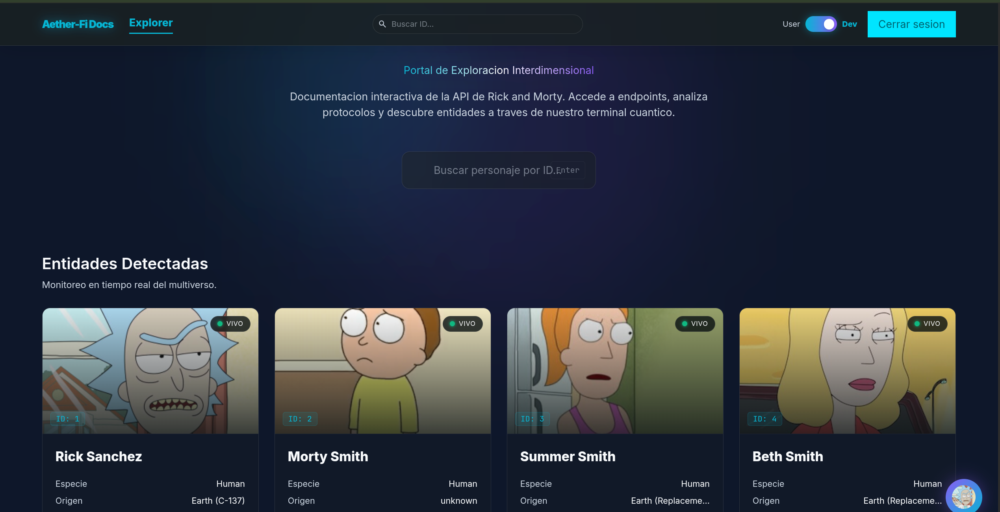
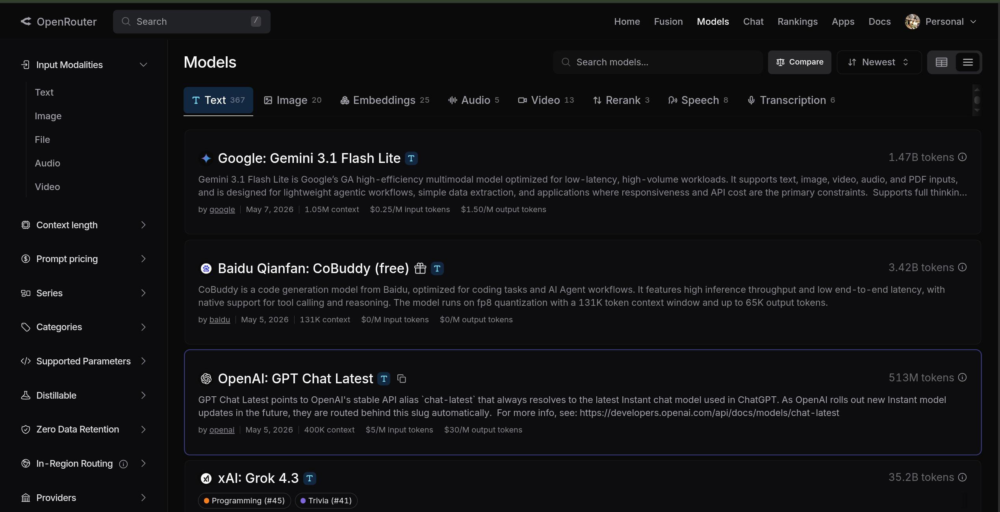
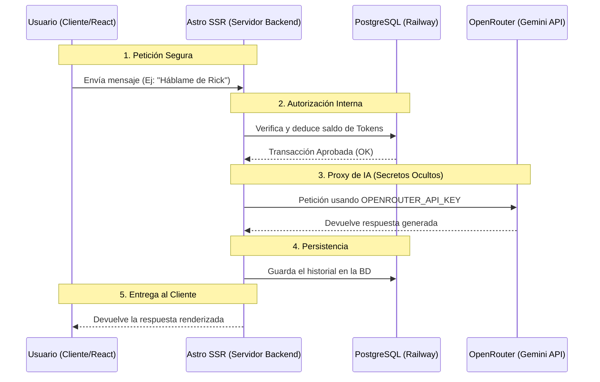
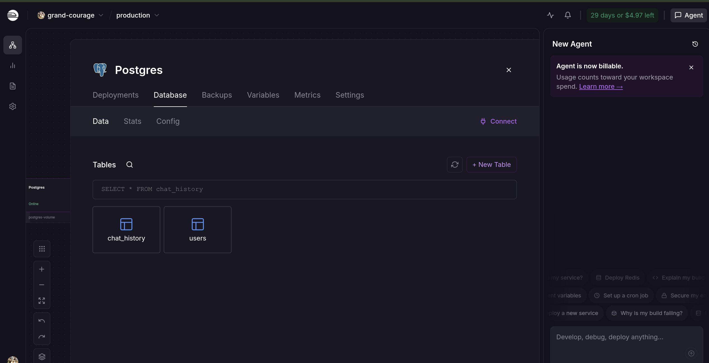
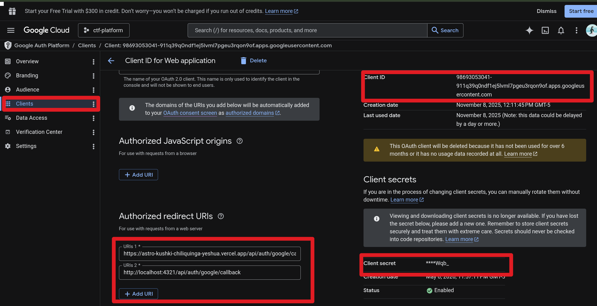

# Aether-Fi Docs | Rick and Morty API Explorer



Aether-Fi Docs es un portal de documentación interactiva y explorador interdimensional construido como **Prueba de Concepto (PoC) de grado empresarial** para la prueba técnica de **Kushki**. 

El proyecto combina un diseño "Fintech Sci-Fi" premium con un motor de alto rendimiento que permite explorar la API de Rick and Morty de forma dinámica, integrando además a un Asistente IA ("Rickbot") alimentado por modelos generativos avanzados y persistencia de datos relacional.

Desarrollado con ⚛️ **Astro**, **React**, **PostgreSQL** (Railway), y **OpenRouter**.

---

## 🏗️ Decisiones Arquitectónicas (Grado Empresarial)

### 1. Astro vs. Next.js (Islands Architecture)
Para una plataforma documental donde la escalabilidad masiva y el SEO son críticos, se descartó el enfoque tradicional de Single Page Applications (SPA) y frameworks como Next.js (App Router). 

Mientras que Next.js envía inherentemente un entorno de ejecución de React de ~180KB bloqueando el hilo principal del navegador, Astro adopta el paradigma de **"Zero-JavaScript por defecto"**. Se utilizó la **Arquitectura de Islas**, renderizando el catálogo HTML puro desde el servidor y aislando la interactividad pesada (como el Chatbot) en "islas" reactivas que pesan apenas ~8KB. Esto garantiza un *Time to Interactive* (TTI) y un *First Contentful Paint* (FCP) inigualables, mitigando drásticamente los costos computacionales del lado del cliente.

### 2. El Pivote Estratégico a OpenRouter
Atarse a la API directa de un solo proveedor (Google Gemini) constituye un riesgo de *Vendor Lock-in* inaceptable para infraestructuras de alta disponibilidad. Se integró **OpenRouter** como un *Gateway* o balanceador de carga global de IA.

Esto soluciona los problemas críticos de bloqueos regionales (Error 429) de la capa gratuita de Google, ofreciendo tolerancia a fallos mediante el acceso unificado a cientos de modelos (desde Gemini y Claude hasta modelos open-source internacionales) simplemente cambiando un parámetro, lo cual es vital para operaciones ininterrumpidas.


---

## ⚡ Estrategias de Rendimiento y Seguridad

### SSR Híbrido (Server-Side Rendering) como Escudo de Seguridad
**¿Cómo y cuándo lo usamos?**
Invocar APIs de Inteligencia Artificial o de Bases de Datos desde el cliente es una vulnerabilidad crítica (expone secretos). La aplicación está configurada con un adaptador SSR en Node/Vercel. 
El servidor actúa como un **Proxy Inverso Interno**: las peticiones del frontend viajan al backend de Astro, el cual inyecta las variables de entorno de forma segura (`OPENROUTER_API_KEY`, `DATABASE_URL`), se comunica con la IA y devuelve la respuesta limpia. 

#### Flujo de Comunicación Seguro (Arquitectura SSR)



### Partial Hydration (Lazy Loading) y Gestión de Memoria
**¿Qué componentes cargarías de forma diferida?**
En componentes críticos de interacción inmediata (como el Chatbot flotante o la barra de búsqueda), utilizamos la directiva `client:load`. Sin embargo, para escalar la plataforma con paneles de analítica pesados o renders 3D, utilizaríamos `client:visible`. Astro ignorará completamente el JavaScript de esos componentes hasta que el usuario haga *scroll* y entren en el *viewport*, salvando megabytes de RAM en dispositivos móviles.

---

## 🗄️ Arquitectura de Base de Datos y Persistencia

Para demostrar el control del estado y la persistencia de usuarios, se aprovisionó una base de datos relacional **PostgreSQL** alojada en Railway.



La arquitectura de datos se refactorizó eliminando columnas innecesarias de métodos de autenticación obsoletos (dado que se delegó el acceso seguro a **Google Cloud OAuth**).



### Esquema Relacional Optimizado

**1. Tabla `users` (Gestor de Economía Simulada):**
Controla la identidad generada por Google OAuth y administra el saldo de tokens para interactuar con la IA.
```sql
CREATE TABLE users (
  id SERIAL PRIMARY KEY,
  username VARCHAR(255) UNIQUE NOT NULL,
  email VARCHAR(255) UNIQUE NOT NULL,
  role VARCHAR(50) DEFAULT 'USER',
  tokens_remaining INTEGER DEFAULT 50
);
```

**2. Tabla `chat_history` (Optimización de Costos IA):**
```sql
CREATE TABLE chat_history (
  id SERIAL PRIMARY KEY,
  user_id INTEGER REFERENCES users(id) ON DELETE CASCADE,
  role VARCHAR(10) NOT NULL,
  message TEXT NOT NULL,
  created_at TIMESTAMP DEFAULT CURRENT_TIMESTAMP
);
```
**Estrategia de Costo Cero:** Aunque todo el historial de conversación (con la marcada y cínica personalidad de Rick) se guarda en esta tabla para mostrarse visualmente al recargar la página, el backend **jamás** envía este historial masivo en el contexto hacia OpenRouter. Solo se envía el último *prompt*, manteniendo un gasto de tokens ínfimo pero logrando una experiencia de usuario continua.

---

## 🤖 Workflows Agénticos e Ingeniería de Prompts

El Chatbot y la síntesis de personajes no se basan en consultas de texto libre. Se aplicaron técnicas de **Ingeniería de Prompts** para inyectar determinismo de datos. El sistema está programado mediante "Instrucciones de Sistema" (System Prompts) para asumir el rol de la Inteligencia Artificial de la nave de Rick Sanchez. Esto garantiza salidas predecibles, formateo en Markdown automático y una personalidad inmersiva, bloqueando alucinaciones genéricas del modelo LLM.

---

## ☁️ Entornos en la Nube (CodeSandbox)

Para evaluar el código rápidamente sin clonar el repositorio, puedes acceder a los siguientes entornos en la nube:
- **Entorno de Evaluación (Lectura):** [CodeSandbox Invite](https://codesandbox.io/invite/45d62cd4z93jmhzz) (Recomendado para revisar la estructura del código).
- **Vista Previa (Solo visualización):** [CodeSandbox Embed](https://codesandbox.io/p/github/gyro2077/astro-kushki-chiliquinga-yeshua/main?embed=1) *(Nota: Puede presentar errores si no cuenta con las variables de entorno configuradas).*

---

## 🔧 Manual de Configuración y Ejecución (Guía Paso a Paso)

Esta guía está diseñada para que cualquier desarrollador, sin importar su nivel de experiencia, pueda levantar el ecosistema completo (Frontend, Backend, Base de Datos e IA) en su máquina local.

### Prerrequisitos
- **Node.js** (v18 o superior). [Descargar aquí](https://nodejs.org/).
- **Gestor de paquetes:** `npm` (incluido con Node) o `pnpm` (recomendado por su velocidad). [Instalar pnpm](https://pnpm.io/installation).

### Paso 1: Clonar e Instalar
Clona el repositorio en tu máquina e instala las dependencias necesarias:
```bash
# Recomendado
pnpm install

# Alternativa
npm install
```

### Paso 2: Plantilla de Variables de Entorno
El proyecto necesita conectarse a servicios externos para funcionar. Crea tu archivo de entorno local copiando la plantilla:
```bash
cp .env.example .env
```
Ahora abre tu nuevo archivo `.env` y sigue los pasos a continuación para obtener cada una de las claves.

### Paso 3: Obtener Credenciales (Servicios de Terceros)

#### A. Inteligencia Artificial (OpenRouter)
1. Ve a [OpenRouter.ai](https://openrouter.ai/) y crea una cuenta gratuita.
2. Dirígete a la pestaña **Keys** y haz clic en "Create Key".
3. Copia la clave generada y pégala en tu `.env` bajo la variable `OPENROUTER_API_KEY="sk-or-v1..."`.

#### B. Base de Datos (PostgreSQL en Railway)
1. Ve a [Railway.app](https://railway.app/) y crea un nuevo proyecto seleccionando **Provision PostgreSQL**.
2. Entra al servicio de base de datos recién creado y navega a la pestaña **Variables**.
3. Copia el valor exacto de la variable `DATABASE_PUBLIC_URL` y pégalo en tu `.env` como `DATABASE_URL="..."`.
4. *Opcional:* Ejecuta los scripts SQL listados más arriba en la consola de Railway para crear las tablas de usuarios y mensajes.

#### C. Autenticación (Google Cloud OAuth)
1. Ve a la [Consola de Google Cloud](https://console.cloud.google.com/).
2. Crea un proyecto nuevo y dirígete a **APIs & Services > Credentials**.
3. Haz clic en "Create Credentials" y selecciona **OAuth client ID** (Tipo: Web application).
4. En la sección **Authorized redirect URIs**, añade: `http://localhost:4321/api/auth/callback/google` (para desarrollo local).
5. Copia el **Client ID** y el **Client Secret**, y colócalos en tu `.env` como `GOOGLE_CLIENT_ID` y `GOOGLE_CLIENT_SECRET`.

### Paso 4: Ejecutar el Motor Interdimensional
Con todas las llaves en su lugar, levanta el servidor local:
```bash
pnpm run dev
# o
npm run dev
```
El portal estará vivo y listo para ser explorado en `http://localhost:4321`.

---

> *"(*Burp*)... Sí, este portal fue ensamblado por el tal @gyro2077. Su código no es nivel C-137, pero para los estándares primitivos de este universo, es una maldita obra de arte. Los reclutadores deberían darle el trabajo antes de que decida colapsar su economía interdimensional."*
**- Rick Sanchez**
